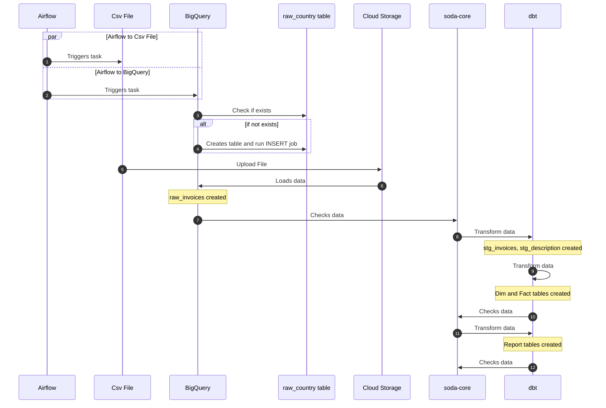

# Data Pipeline Project for Online Retail Store

An end-to-end pipeline that extract data from `.csv` files and transforms it to create data models for analytics use cases
## Introduction

With this project, I constructed a data pipeline tasked with loading and processing data retrieved from a Kaggle dataset.

## The dataset
The dataset contains the transactions occurring between 01/12/2010 and 09/12/2011 for a UK-based and registered non-store online retail company.The company mainly sells unique all-occasion gifts. Many customers of the company are wholesalers.

Access to the dataset is accessible on [Kaggle](https://www.kaggle.com/datasets/tunguz/online-retail).

## Project Objective
- To construct a data pipeline that retrieves, stores, cleans, and presents the data through a straightforward dashboard for visualization. This allows us analyze various aspects such as the types of albums preferred by certain artists, the number of track releases over the years, albums with a high number of tracks, artists with a significant volume of tracks, and the audio features of all tracks in the dataset, among others.

- Set up automated testing (using GitHub actions)

### Built With:
- Dataset: [Kaggle](https://www.kaggle.com/datasets/tunguz/online-retail)
- Infrastructure as Code: Terraform
- Workflow Orchestration: Airflow
- Data Lake: Google Cloud Storage
- Data Warehouse: Google BigQuery
- Transformation: DBT
- Visualisation: Microsoft Power BI
- CICD: GitHub Actions
- Programming Language: Python and SQL

## Architecture


- The cloud infrastructure has been established using Terraform
- Airflow is executed within a local Docker container.


### Workflow



### Data Model


### Data Visualisation


## Getting Started

### Prerequisites
To run the pipeline you'll need:
  1. Install VSCode or any other IDE that works for you.
  2. Install Docker Desktop
  3. A Google Cloud Platform account. (You'll need a service account key to use Bigquery and Cloud Storage)

### Getting the service account key for Google Cloud
- Go to Google Cloud and create a new project.
- Retrieve the `project ID` and define the environment variable GCP_PROJECT_ID in the .env file located in the root directory.
- Create a Service account with the following roles:
  - BigQuery Admin
  - Storage Admin
  - Storage Object Admin
- Download the Service Account credentials
- Rename the downloaded file to `service_account,json` and store it in `./src/airflow/dags/online_retail/gcp/`
## Running the project
### Clone the repository
  ``` sh
  git clone https://gitHub.com/RaymondOnn/batch_pipeline_with_dbt_soda.git
  cd batch_pipeline_with_dbt_soda
  ```

### Update `project_id` value
- You can get the `project_id` value from your `service_account.json`
- Do this for these files:
  - `./src/soda/configuration.yml`
  - `./src/airflow/dags/online_retail/dbt/profiles.yml`

### Start the Docker containers
- Before running the Docker containers, please check that Docker is up and running
- if you have `make` installed
    ```yaml
    make start
    ```
- Otherwise, use this command instead
    ```
    docker compose -f ./docker-compose.yaml up -d
    ```

### Start the pipeline
- Go to http://localhost:8080 to access the Airflow UI. You might need to wait some time for the containers to fully start
- Log into Airflow using `airflow` as both the user and password
- To start the pipeline, run the dag named `online_retail__00`. This dag will trigger the subsequent dags that make up the pipeline
