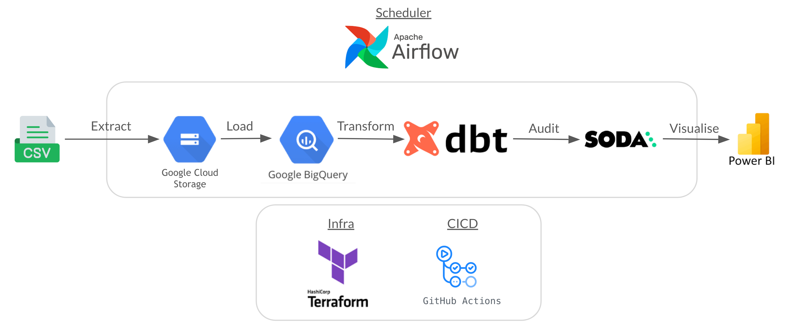
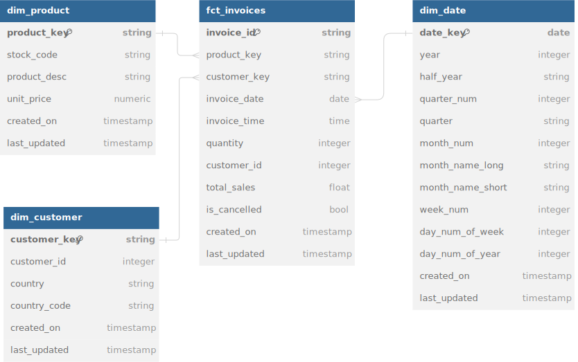

# Data marts with `dbt` and `soda`

An end-to-end pipeline that extract data from `.csv` files and transforms it to create data models for analytics use cases

### Project Objective
- Implement new tools i.e. dbt, soda, astronomer-cosmos, metabase
- Set up automated testing (using Github actions)
  
### Architecture


### Data Model



### Lessons Learnt
- DagBag import error
- . is a path relative to the docker-compose file

## Running the project

### Prerequisites
To run the pipeline you'll need:
  - Docker 
  - Google Cloud Platform's`service_account.json` (credentials needed to use Bigquery and Cloud Storage)

### Steps required
1. Clone the repo
  ``` sh
  git clone <GIT_REPO_URL>
  ```
2. Change the working directory to the folder containing the file contents
  ``` sh
  cd <FOLDER_NAME>
  ```

3. Swapping credentials
- Place your `service_account.json` file under `./src/airflow/dags/online_retail/gcp/`
- Update the `project_id` value. 
  - Copy and paste the `project_id` value from your `service_account.json`
  - Do this for these files:
    - `./src/soda/configuration.yml`
    - `./src/airflow/dags/online_retail/dbt/profiles.yml`

4. Start the Docker containers
   - if you have `make` installed
    ```yaml
    make start
    ```
  - Otherwise, use this command instead
    ``` 
    docker compose -f ./docker-compose.yaml -f ./src/docker/docker-compose.viz.yaml up -d  
    ```
  - Once the container have started, 
    - Airflow UI will be accessible via http://localhost:8080. 
    - Metabase will be accessible via http://localhost:3000

5. Log into Airflow using `airflow` as the user and password
6. To see the pipeline work, trigger on the dag `01_load_invoices`. 
   - This dag will trigger the rest of the dags that make up the pipeline
   